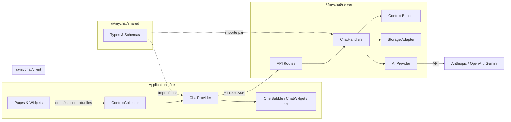
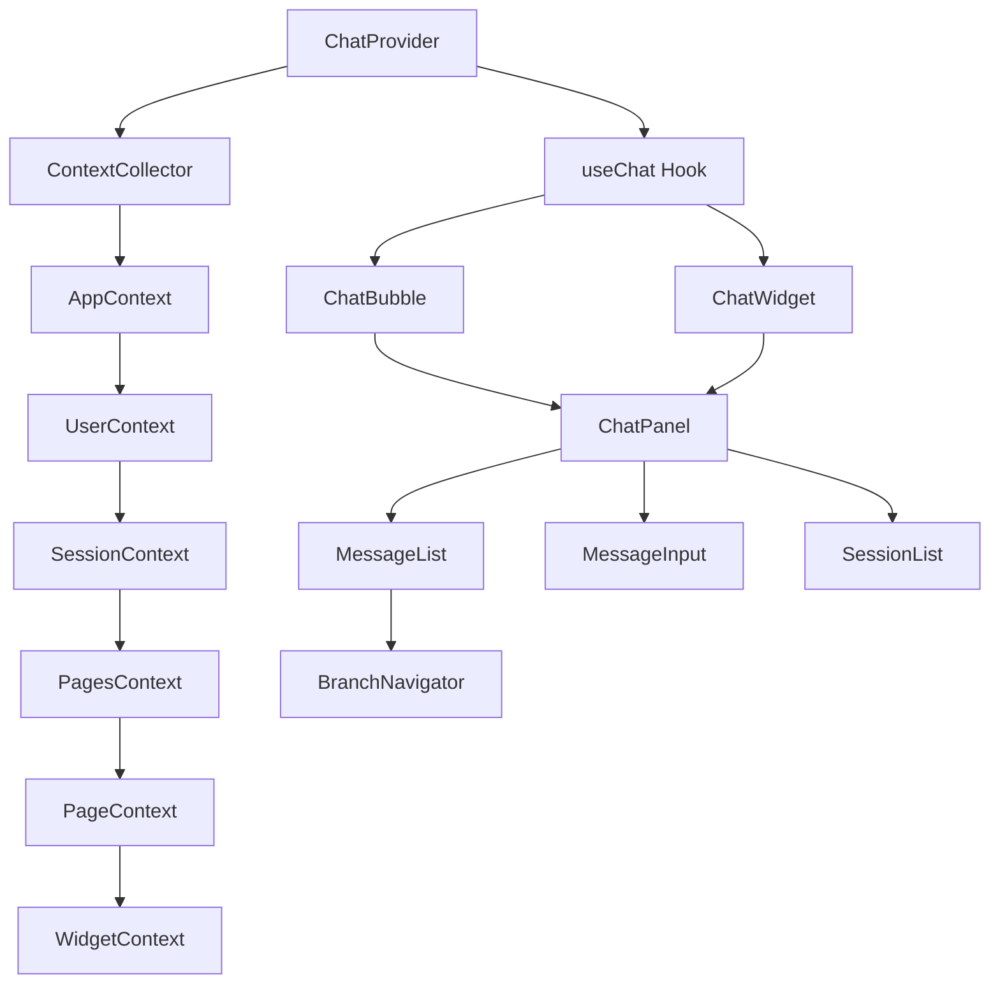
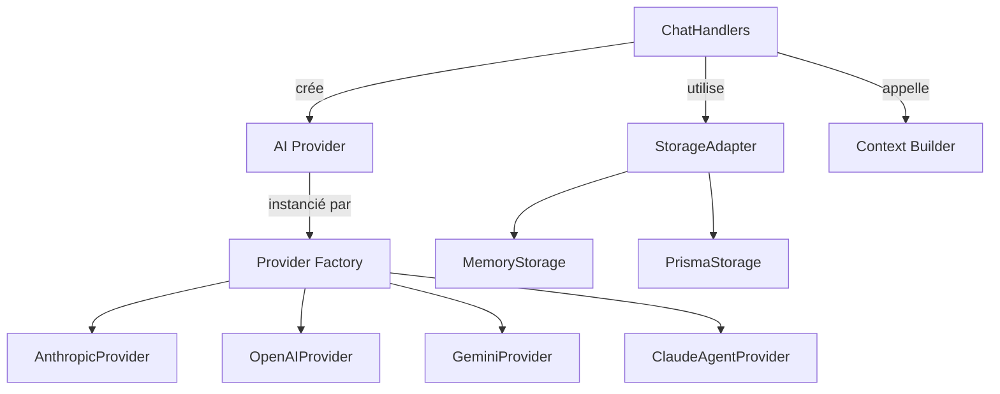
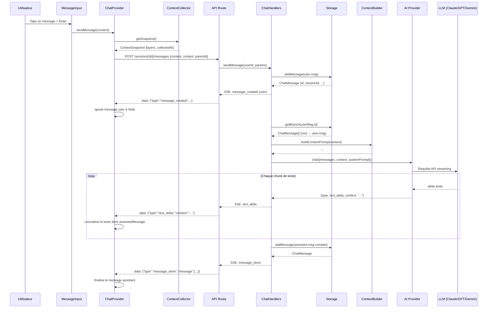
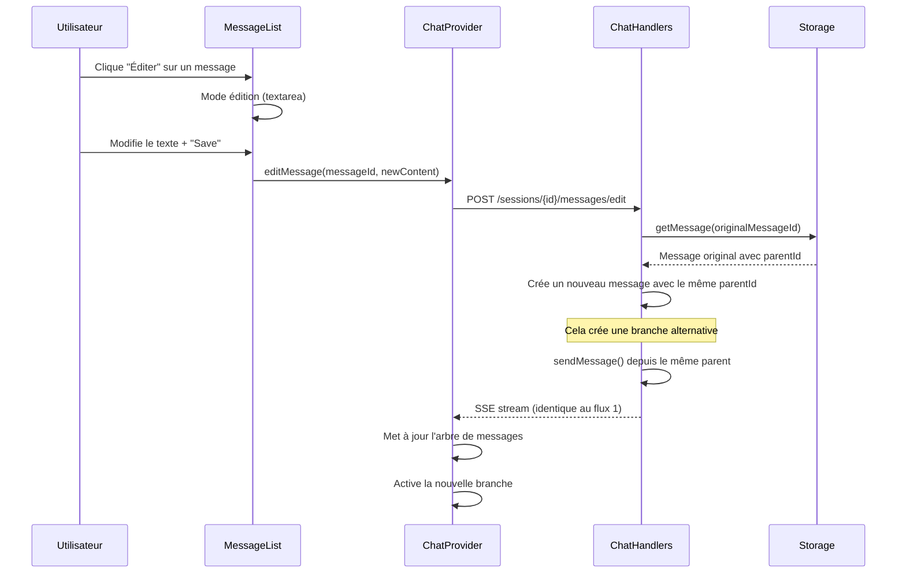
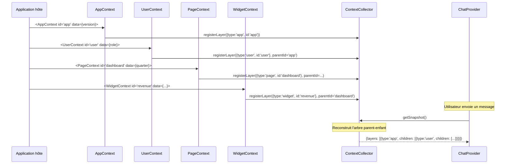
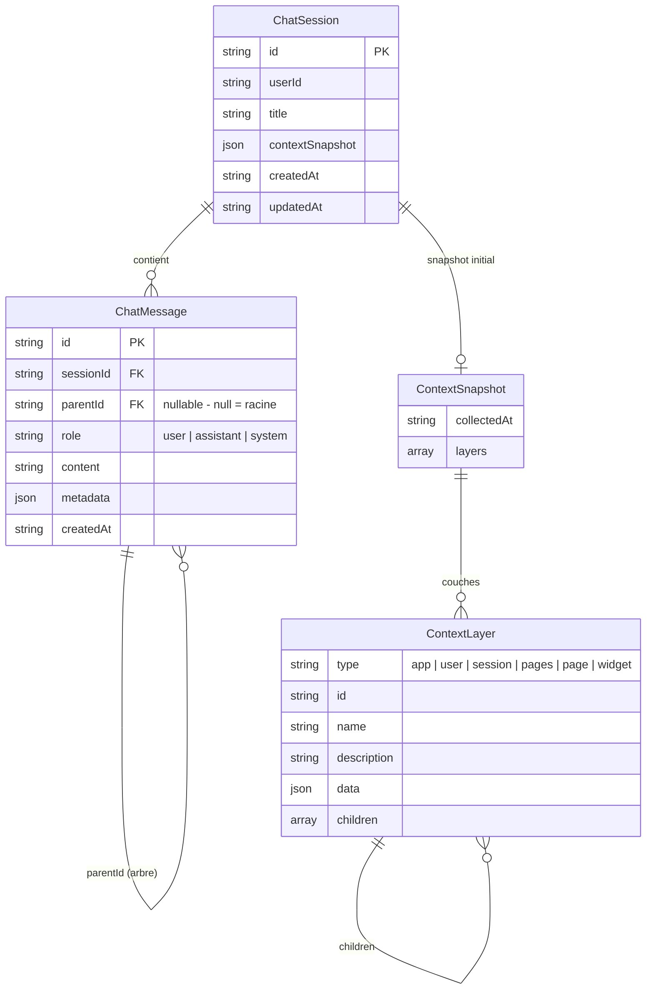
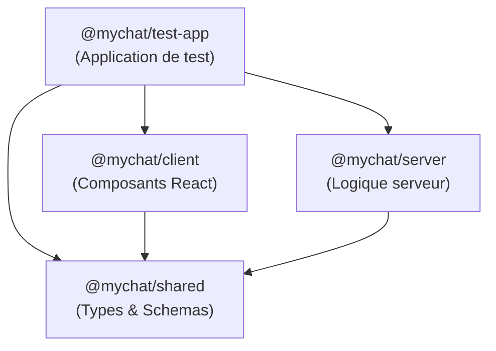

# myChat

> **myChat** est une bibliothèque TypeScript de chat IA contextuel, conçue pour être intégrée dans n'importe quelle application web. Elle collecte automatiquement le contexte de l'interface utilisateur (application, utilisateur, session, pages, widgets) et le transmet à un LLM pour des réponses pertinentes et ancrées dans le contexte réel.

---

## Table des matières

1. [Vue d'ensemble du projet](#1-vue-densemble-du-projet)
2. [Architecture](#2-architecture)
3. [Démarrage rapide](#3-démarrage-rapide)
4. [Workflow de développement](#4-workflow-de-développement)
5. [Guide d'intégration](#5-guide-dintégration)
6. [Visite guidée du code](#6-visite-guidée-du-code)
7. [Patterns récurrents](#7-patterns-récurrents)
8. [Référence API](#8-référence-api)
9. [Dépannage](#9-dépannage)
10. [Concepts clés](#10-concepts-clés)
11. [Ressources externes](#11-ressources-externes)

---

## 1. Vue d'ensemble du projet

### Ce que fait myChat

myChat est une **bibliothèque de chat IA contextuel** qui s'intègre dans des applications web existantes. Sa particularité est la collecte automatique du **contexte applicatif** (page consultée, données des widgets, état de l'interface) pour enrichir les conversations avec un LLM. L'assistant IA peut ainsi répondre de manière pertinente sur les données que l'utilisateur consulte.

### À qui il s'adresse

- **Développeurs** qui veulent ajouter un assistant IA conversationnel à leur application web
- **Équipes produit** qui souhaitent proposer une expérience d'analyse de données via chat
- **Intégrateurs** travaillant avec React, Next.js ou tout framework frontend compatible

### Technologies principales

| Technologie | Version | Rôle |
|-------------|---------|------|
| TypeScript | ^5.7 | Langage principal, typage strict |
| React | ^19.0 | Framework UI (composants client) |
| Node.js | >=20 | Runtime serveur |
| pnpm | — | Gestionnaire de paquets (workspaces) |
| tsup | ^8.4 | Bundler pour les packages bibliothèque |
| Next.js | ^15.3 | Framework de l'application de test |
| Zod | ^3.24 | Validation runtime des schémas |
| Anthropic SDK | ^0.78 | Provider Claude (Anthropic) |
| OpenAI SDK | ^4.77 | Provider GPT + compatible OpenAI |
| Google GenAI | ^1.0 | Provider Gemini |

### État du projet

Actif — version 0.1.0, première implémentation complète avec support multi-provider.

---

## 2. Architecture

### 2.1 Vue d'ensemble de l'architecture



| Composant | Rôle | Technologies | Fichiers clés |
|-----------|------|-------------|---------------|
| **ContextCollector** | Registre mutable des couches de contexte (app, user, session, pages, page, widget). Capture un snapshot à la demande | React Context, useRef | `client/src/providers/ContextCollector.tsx` |
| **ChatProvider** | Gestion d'état du chat : sessions, messages, streaming SSE, navigation de branches | React Context, fetch API | `client/src/providers/ChatProvider.tsx` |
| **ChatBubble / ChatWidget / UI** | Composants visuels : bulle flottante (`ChatBubble`) ou widget inline (`ChatWidget`), liste de messages, saisie, navigation de branches | React, CSS | `client/src/components/*.tsx` |
| **API Routes** | Points d'entrée HTTP. Délèguent aux `ChatHandlers` | Framework hôte (Next.js, Express…) | `test-app/src/app/api/chat/` |
| **ChatHandlers** | Orchestration métier : sauvegarder message, appeler le provider IA, streamer la réponse | TypeScript pur | `server/src/handlers/index.ts` |
| **Context Builder** | Convertit le `ContextSnapshot` hiérarchique en prompt markdown pour le LLM | TypeScript pur | `server/src/context/builder.ts` |
| **Storage Adapter** | Persistance des sessions et messages (arbre de messages avec branches) | Interface + implémentations | `server/src/storage/memory.ts`, `server/src/storage/prisma.ts` |
| **AI Provider** | Adaptateur pour chaque service LLM. Convertit les messages et streame la réponse | SDKs AI | `server/src/providers/*.ts` |
| **Types & Schemas** | Contrats d'interface partagés entre client et serveur, validation Zod | TypeScript, Zod | `shared/src/types/*.ts`, `shared/src/schemas/*.ts` |

### Style architectural

myChat suit une **architecture en couches découplées** (layered architecture) avec une **séparation client/serveur claire** :

- **Couche présentation** (`@mychat/client`) : composants React, gestion d'état UI, collecte de contexte
- **Couche métier** (`@mychat/server`) : orchestration du chat, construction du prompt, streaming
- **Couche données** (`@mychat/server/storage`) : persistance abstraite via `StorageAdapter`
- **Couche partagée** (`@mychat/shared`) : types, schémas, contrats d'interface

Ce choix permet d'intégrer myChat dans **n'importe quel framework** : les handlers serveur sont des fonctions pures (pas de dépendance sur Express, Next.js ou autre), et les composants React fonctionnent dans tout environnement React 18+.

---

### 2.2 Couches de l'application

#### Couche client (`@mychat/client`)



| Composant | Fichier | Rôle |
|-----------|---------|------|
| `ChatProvider` | `providers/ChatProvider.tsx` | Provider React principal. Gère sessions, messages, streaming SSE |
| `ContextCollector` | `providers/ContextCollector.tsx` | Registre mutable des couches de contexte. Arbre construit au snapshot |
| `AppContext` | `providers/AppContext.tsx` | Enregistre le contexte application (type `app`) |
| `UserContext` | `providers/UserContext.tsx` | Enregistre le contexte utilisateur (type `user`) |
| `SessionContext` | `providers/SessionContext.tsx` | Enregistre le contexte session (type `session`) |
| `PagesContext` | `providers/PagesContext.tsx` | Conteneur multi-pages (type `pages`) |
| `PageContext` | `providers/PageContext.tsx` | Enregistre le contexte d'une page (type `page`) |
| `WidgetContext` | `providers/WidgetContext.tsx` | Enregistre le contexte d'un widget (type `widget`) |
| `useChat` | `hooks/useChat.ts` | Hook consommateur du `ChatContext` |
| `ChatBubble` | `components/ChatBubble.tsx` | Bulle flottante cliquable, ouvre le panel (mode `bubble`) |
| `ChatWidget` | `components/ChatWidget.tsx` | Widget inline intégré dans le flux de la page (mode `widget`) |
| `ChatPanel` | `components/ChatPanel.tsx` | Layout principal : header + sidebar + zone de messages (utilisé par ChatBubble et ChatWidget) |
| `MessageList` | `components/MessageList.tsx` | Affichage des messages, scroll auto, mode édition |
| `MessageInput` | `components/MessageInput.tsx` | Zone de saisie avec auto-expansion, Enter pour envoyer |
| `SessionList` | `components/SessionList.tsx` | Liste des conversations dans la sidebar |
| `BranchNavigator` | `components/BranchNavigator.tsx` | Navigation ← 2/3 → entre branches de messages |

**Responsabilités** :
- Collecter le contexte applicatif de manière non intrusive (pas de re-render)
- Gérer l'état du chat côté client (sessions, messages en arbre, branche active)
- Communiquer avec le serveur via HTTP + SSE (Server-Sent Events)
- Afficher une UI de chat complète et personnalisable

**Ce que cette couche ne fait PAS** :
- Aucune logique d'appel au LLM
- Aucune persistance directe — tout passe par l'API serveur
- Aucune authentification — délègue via `getAuthToken()` callback

---

#### Couche serveur (`@mychat/server`)



| Composant | Fichier | Rôle |
|-----------|---------|------|
| `ChatHandlers` | `handlers/index.ts` | Orchestration : réception message → enrichissement contexte → appel IA → sauvegarde → stream |
| `createProvider` | `providers/factory.ts` | Factory pattern (patron de fabrique) : instancie le bon provider selon la config |
| `AnthropicProvider` | `providers/anthropic.ts` | Adaptateur Claude via `@anthropic-ai/sdk` |
| `OpenAIProvider` | `providers/openai.ts` | Adaptateur GPT via `openai` SDK. Supporte aussi les endpoints compatibles OpenAI |
| `GeminiProvider` | `providers/gemini.ts` | Adaptateur Gemini via `@google/genai` |
| `ClaudeAgentProvider` | `providers/claude-agent.ts` | Stub (ébauche) pour future intégration Claude Agent SDK |
| `buildContextPrompt` | `context/builder.ts` | Convertit `ContextSnapshot` en texte markdown structuré pour le system prompt |
| `MemoryStorageAdapter` | `storage/memory.ts` | Stockage en mémoire (Map). Défaut, idéal pour dev/prototypage |
| `PrismaStorageAdapter` | `storage/prisma.ts` | Stockage PostgreSQL via Prisma ORM. Pour production |

**Responsabilités** :
- Persister sessions et messages en arbre (avec branches)
- Construire le system prompt enrichi avec le contexte applicatif
- Appeler le LLM choisi et streamer la réponse en SSE
- Exposer des hooks d'enrichissement (`onContextEnrich`) et post-traitement (`onResponse`)

**Règles de dépendance** :
- `@mychat/server` dépend de `@mychat/shared` (types)
- `@mychat/server` ne dépend PAS de `@mychat/client`
- Les providers dépendent de leurs SDKs respectifs
- Prisma est une dépendance optionnelle (peer dependency)

---

#### Couche partagée (`@mychat/shared`)

**Responsabilités** :
- Définir les types partagés entre client et serveur (contrats d'interface)
- Valider les données entrantes avec des schémas Zod
- Être le seul package importé par TOUS les autres

**Ce que cette couche ne fait PAS** :
- Aucune logique métier
- Aucun effet de bord (pas d'I/O, pas de réseau)

---

### 2.3 Flux de données commenté

#### Flux 1 : Envoyer un message et recevoir une réponse streamée



**Étapes détaillées :**

1. L'utilisateur tape son message dans `MessageInput` et appuie sur Entrée (`client/src/components/MessageInput.tsx:30`)
2. `sendMessage(content)` est appelé dans le `ChatProvider` (`client/src/providers/ChatProvider.tsx:290`)
3. Le `ContextCollector` capture un snapshot de toutes les couches enregistrées (`client/src/providers/ContextCollector.tsx:30`)
4. Le `ChatProvider` envoie un POST à `/sessions/{id}/messages` avec le contenu, le contexte et le `parentId` du dernier message
5. Le handler serveur sauvegarde le message utilisateur via `storage.addMessage()` (`server/src/handlers/index.ts:80`)
6. Le handler émet un événement SSE `message_created` avec le message utilisateur
7. Le handler récupère la branche complète (root → message courant) via `storage.getBranch()` (`server/src/handlers/index.ts:90`)
8. Le `buildContextPrompt()` transforme le contexte hiérarchique en markdown (`server/src/context/builder.ts:8`)
9. Le provider IA est appelé avec l'historique complet + le system prompt enrichi (`server/src/handlers/index.ts:105`)
10. Chaque chunk de texte est renvoyé via SSE `text_delta` — le client met à jour l'affichage en temps réel
11. Une fois la réponse complète, le handler sauvegarde le message assistant et émet `message_done`
12. Le client finalise l'état et met à jour `activeBranchLeafId` (`client/src/providers/ChatProvider.tsx:340-352`)

---

#### Flux 2 : Éditer un message (créer une branche alternative)



**Points clés :**

1. L'édition ne modifie PAS le message original — elle crée une **nouvelle branche** à partir du même parent
2. L'ancien message et ses descendants restent accessibles via le `BranchNavigator`
3. Côté serveur, `editMessage` délègue à `sendMessage` avec le `parentId` du message original (`server/src/handlers/index.ts:140`)

---

#### Flux 3 : Collecte de contexte hiérarchique



**Points clés :**

1. Les 6 niveaux de contexte (`AppContext`, `UserContext`, `SessionContext`, `PagesContext`, `PageContext`, `WidgetContext`) s'enregistrent auprès du `ContextCollector` au **montage** React
2. La hiérarchie parent-enfant est déterminée par l'imbrication JSX via un `ParentLayerContext` partagé
3. L'arbre est reconstruit au moment du `getSnapshot()` (pas à l'enregistrement), ce qui garantit la cohérence quel que soit l'ordre de montage des `useEffect`
4. Le snapshot n'est capturé qu'au moment de l'envoi d'un message — pas de re-render réactif
5. Au **démontage**, les couches se désinscrivent proprement

---

### 2.4 Modèle de données



| Entité | Rôle métier | Relations clés | Fichier modèle |
|--------|------------|----------------|----------------|
| `ChatSession` | Conversation persistante d'un utilisateur | Contient N messages, référence optionnelle à un snapshot de contexte | `shared/src/types/chat.ts:20` |
| `ChatMessage` | Message unitaire (utilisateur ou assistant) dans l'arbre | `parentId` forme un arbre (DAG) : chaque message pointe vers son parent | `shared/src/types/chat.ts:1` |
| `ContextSnapshot` | Photo instantanée du contexte au moment de l'envoi | Contient N couches hiérarchiques | `shared/src/types/context.ts:16` |
| `ContextLayer` | Nœud du contexte (page, widget, app…) avec données arbitraires | Arbre récursif via `children` | `shared/src/types/context.ts:1` |

**Choix notables :**
- **Arbre de messages** (pas une liste) : `parentId` nullable. Cela permet les branches (édition crée une nouvelle branche du même parent). L'UI affiche toujours un chemin linéaire (root → feuille active).
- **Contexte hiérarchique** : l'arbre `ContextLayer` reflète la hiérarchie des composants React (App > User > Session > Pages > Page > Widget).
- **Pas de clés étrangères strictes en mémoire** : le `MemoryStorageAdapter` utilise des `Map` ; les relations sont reconstituées à la volée.

---

### 2.5 Intégrations externes

| Service | Rôle | Comment il est appelé | Configuration | Fichiers |
|---------|------|----------------------|---------------|----------|
| **Anthropic** (Claude) | Provider LLM principal | SDK `@anthropic-ai/sdk`, `client.messages.stream()` | `ANTHROPIC_API_KEY`, model: `claude-sonnet-4-20250514` | `server/src/providers/anthropic.ts` |
| **OpenAI** (GPT) | Provider LLM alternatif | SDK `openai`, `client.chat.completions.create({stream: true})` | API key, model: `gpt-4o`, `baseUrl` optionnel | `server/src/providers/openai.ts` |
| **OpenAI-Compatible** | Proxy ou service compatible OpenAI (LiteLLM, Ollama, vLLM, myOpenAI…) | Même SDK `openai` avec `baseURL` personnalisé | API key + base URL obligatoire | `server/src/providers/factory.ts:17-23` |
| **Google Gemini** | Provider LLM alternatif | SDK `@google/genai`, `client.models.generateContentStream()` | API key, model: `gemini-2.0-flash` | `server/src/providers/gemini.ts` |
| **PostgreSQL** (via Prisma) | Persistance optionnelle | Prisma Client (peer dependency) | Prisma schema, connection string | `server/src/storage/prisma.ts` |

**Mode de dégradation** : si le service LLM est indisponible, le handler lève une erreur qui est propagée au client comme événement SSE `error`. Le message utilisateur est déjà sauvegardé mais aucun message assistant n'est créé.

---

### 2.6 Décisions d'architecture

#### ADR 1 : Handlers serveur comme fonctions pures (framework-agnostique)

- **Décision** : les `ChatHandlers` sont des fonctions TypeScript pures, sans dépendance sur Express, Fastify ou Next.js
- **Contexte** : myChat doit être intégrable dans n'importe quel framework backend
- **Conséquences** : l'application hôte doit écrire les routes API (thin adapter layer). Plus de flexibilité, légèrement plus de code d'intégration
- **Alternatives** : fournir un routeur Express/Fastify prêt à l'emploi (rejeté : limiterait les frameworks supportés)

#### ADR 2 : Arbre de messages avec `parentId` (au lieu d'une liste linéaire)

- **Décision** : chaque message a un `parentId` nullable, formant un DAG (graphe orienté acyclique)
- **Contexte** : supporter l'édition de messages sans perdre l'historique (comme ChatGPT)
- **Conséquences** : complexité accrue pour l'affichage (reconstruction de branche), mais expérience utilisateur riche (navigation entre branches, pas de perte de conversation)
- **Alternatives** : liste linéaire avec versioning (rejeté : perd la capacité de naviguer entre branches)

#### ADR 3 : Contexte collecté à la demande (pas réactif)

- **Décision** : le `ContextCollector` utilise `useRef` (mutable, pas de re-render) et le snapshot est capturé uniquement au moment de l'envoi
- **Contexte** : éviter les boucles de re-render infinies quand les données de contexte changent fréquemment
- **Conséquences** : le contexte envoyé reflète l'état au moment de l'envoi, pas un état intermédiaire. Plus performant.
- **Alternatives** : `useSyncExternalStore` réactif (rejeté : causait des boucles de re-render)

#### ADR 4 : Multi-provider via factory pattern

- **Décision** : une interface `AIProvider` unique, un factory `createProvider(config)` qui instancie le bon adaptateur
- **Contexte** : supporter Anthropic, OpenAI, Gemini et tout endpoint compatible OpenAI
- **Conséquences** : ajouter un nouveau provider = une classe + une entrée dans le switch du factory
- **Alternatives** : pattern strategy avec injection de dépendances (sur-ingénierie pour 4 providers)

---

## 3. Démarrage rapide

### Prérequis

| Outil | Version minimale | Vérification |
|-------|-----------------|-------------|
| Node.js | 20+ | `node -v` |
| pnpm | 8+ | `pnpm -v` |
| Git | — | `git --version` |

### Installation

```bash
# 1. Cloner le dépôt
git clone <url-du-repo> myChat
cd myChat

# 2. Installer les dépendances
pnpm install

# 3. Configurer l'environnement
cp packages/test-app/.env.local.example packages/test-app/.env.local
# Éditer .env.local et ajouter votre clé API :
#   ANTHROPIC_API_KEY=sk-ant-...

# 4. Compiler les packages
pnpm build

# 5. Lancer l'application de test
pnpm dev
```

### Vérification

Ouvrir `http://localhost:3030` dans le navigateur. Vous devriez voir :
- Un **tableau de bord** avec des widgets (revenus, pipeline, clients)
- Une **bulle de chat** en bas à droite (icône indigo)
- Cliquer sur la bulle → le panel de chat s'ouvre
- Envoyer un message comme « Quel est le chiffre d'affaires total ? » → l'IA répond en citant les données du dashboard

### Problèmes courants à l'installation

| Erreur | Cause probable | Solution |
|--------|---------------|----------|
| `Cannot find module '@mychat/shared'` | Packages non compilés | Exécuter `pnpm build` avant `pnpm dev` |
| `Cannot find module './625.js'` | Cache webpack corrompu | Supprimer `packages/test-app/.next/` puis relancer |
| `ANTHROPIC_API_KEY is not set` | Variable d'environnement manquante | Créer `.env.local` avec la clé, ou configurer via `/config` |
| `TypeError: Cannot convert undefined or null to object` | Données de contexte manquantes | S'assurer que les `data` des ContextLayer ne sont pas `undefined` |
| Port 3030 déjà utilisé | Autre processus sur le port | `lsof -i :3030` pour identifier, puis kill |

---

## 4. Workflow de développement

### Lancer en local

```bash
# Serveur de développement (Next.js avec hot-reload)
pnpm dev
# → http://localhost:3030

# Compilation en mode watch (pour développer les packages lib)
# Terminal 1 : shared
cd packages/shared && pnpm dev

# Terminal 2 : server
cd packages/server && pnpm dev

# Terminal 3 : client
cd packages/client && pnpm dev

# Terminal 4 : test-app
cd packages/test-app && pnpm dev
```

### Compiler pour production

```bash
pnpm build
# Compile tous les packages dans l'ordre de dépendance :
# shared → server → client → test-app
```

### Linter

```bash
pnpm lint
# ESLint sur packages/*/src/**/*.{ts,tsx}
```

### Variables d'environnement

| Variable | Obligatoire | Package | Description | Exemple |
|----------|-------------|---------|-------------|---------|
| `ANTHROPIC_API_KEY` | Non* | test-app | Clé API Anthropic par défaut | `sk-ant-api03-...` |

*\*Non obligatoire si vous configurez un autre provider via la page `/config`.*

### Configuration runtime (page `/config`)

L'application de test dispose d'une page de configuration accessible à `http://localhost:3030/config` qui permet de :
- Changer de provider IA (Anthropic, OpenAI, OpenAI-Compatible, Gemini)
- Saisir la clé API et le modèle
- Configurer un endpoint compatible OpenAI (base URL)
- Modifier le system prompt
- Tester la connexion

La configuration est stockée en mémoire (`globalThis`) et persiste tant que le serveur tourne (survit au hot-reload Next.js).

---

## 5. Guide d'intégration

### 5.1 Installation dans votre application

```bash
# Installer les packages myChat
pnpm add @mychat/shared @mychat/server @mychat/client
```

### 5.2 Intégration côté serveur (API Routes)

Les `ChatHandlers` sont des fonctions pures — vous devez les exposer via les routes de votre framework.

#### Exemple avec Next.js App Router

```typescript
// app/api/chat/sessions/route.ts
import { createChatHandlers } from '@mychat/server';

const handlers = createChatHandlers({
  provider: {
    type: 'anthropic',
    apiKey: process.env.ANTHROPIC_API_KEY!,
    model: 'claude-sonnet-4-20250514',
  },
  systemPrompt: 'Vous êtes un assistant intégré dans notre application.',
});

export async function GET() {
  const sessions = await handlers.listSessions('user-1');
  return Response.json(sessions);
}

export async function POST(req: Request) {
  const body = await req.json();
  const session = await handlers.createSession('user-1', body);
  return Response.json(session);
}
```

```typescript
// app/api/chat/sessions/[sessionId]/messages/route.ts
export async function POST(req: Request, { params }: { params: { sessionId: string } }) {
  const body = await req.json();
  const stream = handlers.sendMessage('user-1', body);

  const encoder = new TextEncoder();
  const readable = new ReadableStream({
    async start(controller) {
      for await (const chunk of stream) {
        controller.enqueue(encoder.encode(chunk));
      }
      controller.close();
    },
  });

  return new Response(readable, {
    headers: {
      'Content-Type': 'text/event-stream',
      'Cache-Control': 'no-cache',
      Connection: 'keep-alive',
    },
  });
}
```

#### Exemple avec Express

```typescript
import express from 'express';
import { createChatHandlers } from '@mychat/server';

const app = express();
app.use(express.json());

const handlers = createChatHandlers({
  provider: {
    type: 'openai-compatible',
    apiKey: 'sk-your-key',
    baseUrl: 'https://your-proxy.example.com/v1',
    model: 'claude-code',
  },
  systemPrompt: 'Vous êtes un assistant...',
});

// Lister les sessions
app.get('/api/chat/sessions', async (req, res) => {
  const userId = req.user.id; // votre auth
  const sessions = await handlers.listSessions(userId);
  res.json(sessions);
});

// Envoyer un message (SSE streaming)
app.post('/api/chat/sessions/:sessionId/messages', async (req, res) => {
  res.setHeader('Content-Type', 'text/event-stream');
  res.setHeader('Cache-Control', 'no-cache');
  res.setHeader('Connection', 'keep-alive');

  const stream = handlers.sendMessage(req.user.id, req.body);
  for await (const chunk of stream) {
    res.write(chunk);
  }
  res.end();
});

app.listen(3000);
```

### 5.3 Définir le contexte : de l'application au widget

myChat collecte le contexte de votre interface via un **arbre de composants React** à 6 niveaux :

```
ChatProvider                    ← point d'entrée, englobe toute l'app
  └─ AppContext                 ← métadonnées de l'application (nom, version)
       └─ UserContext           ← informations utilisateur (rôle, préférences)
            └─ SessionContext   ← état de la session (thème, navigation)
                 └─ PagesContext      ← conteneur de pages (layout, page active)
                      ├─ PageContext   ← une page (données globales de la page)
                      │    ├─ WidgetContext   ← widget (graphique, tableau…)
                      │    └─ WidgetContext
                      └─ PageContext   ← une autre page (split-view, onglets…)
                           └─ WidgetContext
```

Chaque niveau est **optionnel** — vous pouvez utiliser uniquement `PageContext` + `WidgetContext` si vous n'avez pas besoin des niveaux supérieurs. La hiérarchie parent-enfant se construit automatiquement par l'imbrication JSX.

Quand l'utilisateur envoie un message, myChat **capture un snapshot** de toutes les couches enregistrées à cet instant et l'envoie au serveur. Le serveur le transforme en un bloc markdown injecté dans le **system prompt** du LLM. L'IA voit donc exactement ce que l'utilisateur voit.

Tous les composants de contexte partagent les mêmes props :

| Prop | Type | Obligatoire | Rôle |
|------|------|:-----------:|------|
| `id` | `string` | oui | Identifiant unique et stable (pas de `uuid()` à chaque render) |
| `name` | `string` | oui | Nom lisible transmis au LLM |
| `description` | `string` | non | Description en langage naturel — **c'est ici que vous guidez l'IA** |
| `data` | `Record<string, unknown>` | oui | Données factuelles visibles par l'IA |

**Ce qui se passe en interne** : chaque composant s'enregistre auprès du `ContextCollector` au montage, et se désinscrit au démontage. La hiérarchie parent-enfant est déterminée par l'imbrication JSX via un `ParentLayerContext` partagé. L'arbre est reconstruit au moment du snapshot (pas à l'enregistrement), ce qui garantit la cohérence quel que soit l'ordre de montage.

#### Les 6 niveaux de contexte

| Composant | Type | Rôle | Exemple de données |
|-----------|------|------|-------------------|
| `AppContext` | `app` | Métadonnées globales de l'application | `{ version: '1.0', environment: 'production' }` |
| `UserContext` | `user` | Informations sur l'utilisateur courant | `{ role: 'sales-manager', locale: 'fr-FR' }` |
| `SessionContext` | `session` | État de la session de navigation | `{ theme: 'light', startedAt: '...' }` |
| `PagesContext` | `pages` | Conteneur de pages (onglets, split-view) | `{ activePage: 'dashboard', layout: 'tabs' }` |
| `PageContext` | `page` | Page courante et ses données globales | `{ currentQuarter: 'Q1-2026' }` |
| `WidgetContext` | `widget` | Widget individuel (graphique, tableau, KPI) | `{ total: 397000, currency: 'EUR' }` |

#### Exemple complet : hiérarchie complète avec multi-pages

```tsx
'use client';
import {
  ChatProvider, ChatBubble,
  AppContext, UserContext, SessionContext, PagesContext, PageContext, WidgetContext,
} from '@mychat/client';
import '@mychat/client/styles.css';

export default function App() {
  return (
    <ChatProvider config={{ serverUrl: '/api/chat', mode: 'bubble' }}>
      <AppContext
        id="my-app"
        name="Mon Application"
        description="Application de gestion commerciale"
        data={{ version: '2.0', environment: 'production' }}
      >
        <UserContext
          id="current-user"
          name="Marie Dupont"
          description="Responsable commerciale, région Île-de-France"
          data={{ role: 'sales-manager', locale: 'fr-FR', region: 'IDF' }}
        >
          <SessionContext
            id="current-session"
            name="Session Dashboard"
            description="Consultation du tableau de bord commercial"
            data={{ theme: 'light', startedAt: new Date().toISOString() }}
          >
            <PagesContext
              id="main-pages"
              name="Pages actives"
              data={{ activePage: 'sales-dashboard', layout: 'single' }}
            >
              <PageContext
                id="sales-dashboard"
                name="Sales Dashboard"
                description="Vue d'ensemble des performances commerciales"
                data={{ currentQuarter: 'Q1-2026' }}
              >
                <WidgetContext
                  id="revenue-chart"
                  name="Revenue Chart"
                  description="Graphique du CA mensuel"
                  data={{ total: 397000, currency: 'EUR', trend: '+16.4%' }}
                >
                  <RevenueChart />
                </WidgetContext>

                <WidgetContext
                  id="top-clients"
                  name="Top Clients"
                  description="Tableau des 5 meilleurs clients par CA"
                  data={{ clients: [{ name: 'Acme', revenue: 85000 }] }}
                >
                  <ClientsTable />
                </WidgetContext>
              </PageContext>
            </PagesContext>
          </SessionContext>
        </UserContext>
      </AppContext>

      <ChatBubble />
    </ChatProvider>
  );
}
```

#### Ce que le LLM reçoit

Le serveur transforme le snapshot en markdown structuré, injecté dans le system prompt :

```markdown
## Application Context

### App: Mon Application
Description: Application de gestion commerciale
Data: {"version":"2.0","environment":"production"}

#### User: Marie Dupont
Description: Responsable commerciale, région Île-de-France
Data: {"role":"sales-manager","locale":"fr-FR","region":"IDF"}

##### Session: Session Dashboard
Description: Consultation du tableau de bord commercial
Data: {"theme":"light","startedAt":"2026-03-17T..."}

###### Pages: Pages actives
Data: {"activePage":"sales-dashboard","layout":"single"}

###### Page: Sales Dashboard
Description: Vue d'ensemble des performances commerciales
Data: {"currentQuarter":"Q1-2026"}

###### Widget: Revenue Chart
Description: Graphique du CA mensuel
Data: {"total":397000,"currency":"EUR","trend":"+16.4%"}

###### Widget: Top Clients
Description: Tableau des 5 meilleurs clients par CA
Data: {"clients":[{"name":"Acme","revenue":85000}]}
```

L'IA sait que Marie est une responsable commerciale qui consulte le dashboard Q1-2026, et peut répondre « Le CA total est de 397 000 EUR, en hausse de 16.4% » en citant les chiffres réels.

#### Multi-pages (split-view, onglets)

`PagesContext` peut contenir plusieurs `PageContext` simultanés — utile pour les interfaces avec onglets ou split-view :

```tsx
<PagesContext id="workspace" name="Workspace" data={{ layout: 'split-view' }}>
  <PageContext id="editor" name="Éditeur" data={{ file: 'main.ts', language: 'typescript' }}>
    <WidgetContext id="code" name="Code" data={{ lines: 150, cursor: 42 }}>
      <CodeEditor />
    </WidgetContext>
  </PageContext>

  <PageContext id="preview" name="Aperçu" data={{ url: '/preview', status: 'live' }}>
    <WidgetContext id="render" name="Rendu" data={{ errors: 0 }}>
      <LivePreview />
    </WidgetContext>
  </PageContext>
</PagesContext>
```

L'IA verra les deux pages et pourra répondre sur le code ET l'aperçu.

#### Mode d'affichage : Bubble vs Widget

myChat propose deux modes d'affichage du chat :

| Mode | Composant | Description |
|------|-----------|-------------|
| **Bubble** | `<ChatBubble />` | Bouton flottant en bas de l'écran. Un clic ouvre un panel de chat superposé. Idéal pour un assistant discret. |
| **Widget** | `<ChatWidget />` | Panel de chat intégré directement dans le flux de la page. Idéal pour un assistant toujours visible. |

```tsx
import { ChatBubble, ChatWidget } from '@mychat/client';

{/* Mode bubble (défaut) — bouton flottant */}
<ChatProvider config={{ serverUrl: '/api/chat' }}>
  {/* ... contexte et contenu ... */}
  <ChatBubble />
</ChatProvider>

{/* Mode widget — intégré dans la page */}
<ChatProvider config={{ serverUrl: '/api/chat' }}>
  {/* ... contexte et contenu ... */}
  <ChatWidget width="100%" height="500px" />
</ChatProvider>
```

**Props de `ChatWidget`** :

| Prop | Type | Défaut | Description |
|------|------|--------|-------------|
| `width` | `string` | `'100%'` | Largeur CSS du widget |
| `height` | `string` | `'500px'` | Hauteur CSS du widget |
| `className` | `string` | — | Classe CSS additionnelle |

Les deux modes utilisent le même `ChatPanel` en interne et partagent donc les mêmes fonctionnalités (sessions, messages, branches, streaming).

#### Niveaux optionnels

Chaque niveau est indépendant. Vous pouvez utiliser uniquement ce dont vous avez besoin :

```tsx
{/* Minimal : juste Page + Widget (rétro-compatible) */}
<ChatProvider config={chatConfig}>
  <PageContext id="page" name="Page" data={{}}>
    <WidgetContext id="w" name="Widget" data={{ value: 42 }}>
      <MyComponent />
    </WidgetContext>
  </PageContext>
  <ChatBubble />  {/* ou <ChatWidget /> */}
</ChatProvider>

{/* Ou même un widget seul */}
<ChatProvider config={chatConfig}>
  <WidgetContext id="standalone" name="Sidebar" data={{ notifications: 3 }}>
    <Sidebar />
  </WidgetContext>
  <ChatWidget height="400px" />
</ChatProvider>
```

#### Bonnes pratiques

**Le `data` est la clé** — mettez-y les données que l'utilisateur voit à l'écran :

```tsx
// Bien : données factuelles exploitables par l'IA
data={{ total: 397000, currency: 'EUR', trend: '+16.4%' }}

// Moins utile : pas de données concrètes
data={{ chartType: 'bar', color: '#6366f1' }}
```

**La `description` guide l'IA** — sans elle, le LLM voit du JSON brut sans contexte métier.

**Données dynamiques** — le snapshot est capturé au moment de l'envoi du message, donc l'IA voit toujours les données à jour. Passez directement les variables d'état React dans `data`.

**Ne pas tout exposer** — envoyez uniquement les données utiles pour la conversation, pas les IDs internes ou métadonnées techniques.

#### Résumé visuel du flux

```
ChatProvider
  └─ AppContext id="app" data={version, env}
       └─ UserContext id="user" data={role, locale}
            └─ SessionContext id="session" data={theme}
                 └─ PagesContext id="pages" data={activePage, layout}
                      └─ PageContext id="dashboard" data={quarter}
                           ├─ WidgetContext id="revenue"  data={total, trend}
                           └─ WidgetContext id="clients"  data={clients[]}

         ↓ au moment de l'envoi d'un message ↓

ContextSnapshot {
  collectedAt: "2026-03-17T10:30:00Z",
  layers: [
    { type: "app", id: "app", children: [
      { type: "user", id: "user", children: [
        { type: "session", id: "session", children: [
          { type: "pages", id: "pages", children: [
            { type: "page", id: "dashboard", children: [
              { type: "widget", id: "revenue", data: {...} },
              { type: "widget", id: "clients", data: {...} },
            ]}
          ]}
        ]}
      ]}
    ]}
  ]
}

         ↓ transformé par le serveur en prompt markdown ↓
         ↓ injecté dans le system prompt du LLM ↓
```

### 5.4 Configuration avancée

#### Provider OpenAI-Compatible (proxy, LiteLLM, Ollama…)

```typescript
const handlers = createChatHandlers({
  provider: {
    type: 'openai-compatible',
    apiKey: 'sk-your-proxy-key',
    baseUrl: 'https://ia.example.com/v1',
    model: 'claude-code',
    maxTokens: 8192,
  },
});
```

#### Stockage persistant avec Prisma

```typescript
import { createChatHandlers } from '@mychat/server';
import { PrismaStorageAdapter } from '@mychat/server/adapters/prisma';
import { PrismaClient } from '@prisma/client';

const prisma = new PrismaClient();

const handlers = createChatHandlers({
  provider: { type: 'anthropic', apiKey: '...' },
  storage: new PrismaStorageAdapter(prisma),
});
```

Modèle Prisma requis :

```prisma
model ChatSession {
  id              String   @id @default(uuid())
  userId          String
  title           String   @default("Untitled")
  contextSnapshot Json?
  createdAt       DateTime @default(now())
  updatedAt       DateTime @updatedAt
  messages        ChatMessage[]
}

model ChatMessage {
  id        String   @id @default(uuid())
  sessionId String
  parentId  String?
  role      String
  content   String   @db.Text
  metadata  Json?
  createdAt DateTime @default(now())
  session   ChatSession @relation(fields: [sessionId], references: [id])
}
```

#### Hooks d'enrichissement et post-traitement

```typescript
const handlers = createChatHandlers({
  provider: { /* ... */ },

  // Enrichir le contexte avant l'appel au LLM
  onContextEnrich: async (context) => {
    // Ex: ajouter des données de la base de données
    const userPrefs = await db.getUserPrefs(userId);
    context.layers.push({
      type: 'user',
      id: 'prefs',
      name: 'Préférences utilisateur',
      data: userPrefs,
    });
    return context;
  },

  // Traiter la réponse après le streaming
  onResponse: async (message) => {
    // Ex: logger, analyser le sentiment, mettre en cache
    await analytics.track('ai_response', {
      sessionId: message.sessionId,
      length: message.content.length,
    });
  },
});
```

#### Authentification

myChat **délègue** l'authentification à l'application hôte :

- **Côté client** : fournir un callback `getAuthToken()` dans `MyChatClientConfig`
- **Côté serveur** : extraire l'utilisateur dans vos routes API et passer le `userId` aux handlers

```typescript
// Client
config.getAuthToken = async () => {
  const session = await getSession(); // votre lib auth
  return session?.accessToken ?? '';
};

// Serveur (Next.js)
export async function POST(req: Request) {
  const token = req.headers.get('Authorization')?.replace('Bearer ', '');
  const user = await verifyToken(token); // votre vérification
  const stream = handlers.sendMessage(user.id, body);
  // ...
}
```

---

## 6. Visite guidée du code

### Dépendances inter-modules



### @mychat/shared

**But** : contrats d'interface partagés entre client et serveur.

| Fichier | Rôle |
|---------|------|
| `src/types/chat.ts` | Types `ChatMessage`, `ChatSession`, `ChatBranch`, `MessageRole`, `ChatStreamEvent`, paramètres d'API |
| `src/types/context.ts` | Types `ContextLayer`, `ContextLayerType`, `ContextSnapshot` |
| `src/types/provider.ts` | Interface `AIProvider`, configs de chaque provider, interface `AgentCapableProvider` |
| `src/types/storage.ts` | Interface `StorageAdapter` |
| `src/types/config.ts` | `MyChatServerConfig`, `MyChatClientConfig`, `ChatLabels`, `defaultLabels` |
| `src/schemas/chat.schema.ts` | Validation Zod : `sendMessageSchema`, `editMessageSchema`, `createSessionSchema` |
| `src/schemas/context.schema.ts` | Validation Zod : `contextLayerSchema`, `contextSnapshotSchema` |
| `src/index.ts` | Point d'entrée, ré-exporte tout |

**Point d'entrée lecture** : commencer par `src/types/chat.ts` pour comprendre le modèle de données, puis `src/types/context.ts` pour le contexte hiérarchique.

---

### @mychat/server

**But** : logique métier serveur, providers IA, persistance.

| Fichier | Rôle |
|---------|------|
| `src/handlers/index.ts` | Orchestration complète du chat. **Le fichier le plus important du serveur.** |
| `src/providers/factory.ts` | Instancie le bon provider selon la config |
| `src/providers/anthropic.ts` | Adaptateur Claude : streaming via `messages.stream()` |
| `src/providers/openai.ts` | Adaptateur GPT/Compatible : streaming via `chat.completions.create()` |
| `src/providers/gemini.ts` | Adaptateur Gemini : streaming via `generateContentStream()` |
| `src/providers/claude-agent.ts` | Stub pour future intégration Agent SDK |
| `src/context/builder.ts` | Transformation contexte → prompt markdown |
| `src/storage/memory.ts` | Stockage en mémoire (Map). Défaut pour dev |
| `src/storage/prisma.ts` | Stockage PostgreSQL via Prisma |
| `src/index.ts` | Exports publics |

**Point d'entrée lecture** : commencer par `src/handlers/index.ts` — il orchestre tout le flux. Puis explorer les providers et le storage.

---

### @mychat/client

**But** : composants React et gestion d'état côté client.

| Fichier | Rôle |
|---------|------|
| `src/providers/ChatProvider.tsx` | **Fichier central.** État du chat, sessions, messages, streaming SSE, branches |
| `src/providers/ContextCollector.tsx` | Registre mutable des couches de contexte. Expose `ParentLayerContext` pour la hiérarchie |
| `src/providers/AppContext.tsx` | Provider de contexte niveau application |
| `src/providers/UserContext.tsx` | Provider de contexte niveau utilisateur |
| `src/providers/SessionContext.tsx` | Provider de contexte niveau session |
| `src/providers/PagesContext.tsx` | Provider conteneur de pages (multi-page) |
| `src/providers/PageContext.tsx` | Provider de contexte niveau page |
| `src/providers/WidgetContext.tsx` | Provider de contexte niveau widget (nœud feuille) |
| `src/hooks/useChat.ts` | Hook d'accès au ChatContext |
| `src/hooks/useContextCollector.ts` | Hook d'accès au ContextCollector |
| `src/components/ChatBubble.tsx` | Bulle flottante cliquable (mode bubble) |
| `src/components/ChatWidget.tsx` | Widget inline intégré dans la page (mode widget) |
| `src/components/ChatPanel.tsx` | Layout principal du chat |
| `src/components/MessageList.tsx` | Affichage des messages + édition + branches |
| `src/components/MessageInput.tsx` | Zone de saisie auto-extensible |
| `src/components/SessionList.tsx` | Liste des conversations |
| `src/components/BranchNavigator.tsx` | Navigation ← 2/3 → entre branches |
| `src/styles/chat.css` | Styles autonomes avec variables CSS |
| `src/__tests__/context-hierarchy.test.tsx` | Tests de la hiérarchie de contexte (14 tests) |
| `vitest.config.ts` | Configuration Vitest avec jsdom |

**Point d'entrée lecture** : commencer par `src/providers/ChatProvider.tsx` — c'est le cœur du client. Pour le système de contexte, commencer par `ContextCollector.tsx` puis les providers dans l'ordre hiérarchique.

---

### @mychat/test-app

**But** : application de démonstration Next.js intégrant les trois packages.

| Fichier | Rôle |
|---------|------|
| `src/app/page.tsx` | Dashboard de vente avec hiérarchie complète (App → User → Session → Pages → Page → Widget), toggle Bubble/Widget |
| `src/app/config/page.tsx` | Page de configuration runtime du provider IA |
| `src/app/api/chat/handlers.ts` | Factory des ChatHandlers avec cache par config |
| `src/app/api/chat/sessions/route.ts` | Routes GET/POST sessions |
| `src/app/api/chat/sessions/[sessionId]/route.ts` | Route DELETE session |
| `src/app/api/chat/sessions/[sessionId]/messages/route.ts` | Routes GET messages + POST message (SSE) |
| `src/app/api/chat/sessions/[sessionId]/messages/edit/route.ts` | Route POST édition (SSE) |
| `src/app/api/config/route.ts` | Routes GET/PUT/DELETE config runtime |
| `src/lib/config-store.ts` | Store de config via globalThis |

**Point d'entrée lecture** : commencer par `src/app/page.tsx` pour voir comment le chat est intégré dans une page.

---

## 7. Patterns récurrents

### Ajouter un nouveau provider IA

1. **Créer la config** dans `packages/shared/src/types/provider.ts` :
   - Ajouter une interface `NouveauProviderConfig` (voir `GeminiProviderConfig:86` comme modèle)
   - Ajouter au type union `ProviderConfig` (`provider.ts:101`)

2. **Exporter le type** dans `packages/shared/src/index.ts`

3. **Créer l'adaptateur** dans `packages/server/src/providers/nouveau.ts` :
   - Implémenter l'interface `AIProvider` (voir `gemini.ts` comme modèle le plus simple)
   - La méthode `chat()` doit être un `async *generator` qui yield des `ChatStreamEvent`

4. **Enregistrer dans le factory** dans `packages/server/src/providers/factory.ts:10` :
   - Ajouter un `case` dans le switch

5. **Exporter le provider** dans `packages/server/src/index.ts`

6. **(Optionnel) Ajouter à l'UI de config** dans `packages/test-app/src/app/config/page.tsx` :
   - Ajouter dans `PROVIDER_LABELS`, `MODEL_DEFAULTS` et la liste radio

### Ajouter une nouvelle route API dans le test-app

1. Créer le fichier dans `packages/test-app/src/app/api/<path>/route.ts`
2. Exporter les fonctions HTTP (`GET`, `POST`, `PUT`, `DELETE`)
3. Utiliser `getHandlers()` de `../chat/handlers.ts` pour accéder aux ChatHandlers
4. Pour le streaming SSE : utiliser `ReadableStream` + `TextEncoder` (voir `sessions/[sessionId]/messages/route.ts` comme modèle)

### Ajouter un nouveau composant UI client

1. Créer le composant dans `packages/client/src/components/NouveauComposant.tsx`
2. Utiliser le hook `useChat()` pour accéder à l'état du chat
3. Exporter dans `packages/client/src/index.ts`
4. Recompiler : `pnpm build:client`

### Ajouter une nouvelle couche de contexte

Le système de contexte supporte 6 types prédéfinis : `app`, `user`, `session`, `pages`, `page`, `widget`.

Pour passer du contexte personnalisé, imbriquer les providers dans l'ordre hiérarchique :
```tsx
<AppContext id="mon-app" name="Mon Application" data={{ version: '1.0' }}>
  <UserContext id="user-1" name="Jean" data={{ role: 'admin' }}>
    <SessionContext id="session-1" name="Session active" data={{ theme: 'dark' }}>
      <PagesContext id="pages-1" name="Navigation" data={{ activePage: 'dashboard' }}>
        <PageContext id="page-dashboard" name="Dashboard" data={{ vue: "ventes" }}>
          <WidgetContext id="widget-kpi" name="KPI Ventes" data={{ metric: 42 }}>
            {/* contenu */}
          </WidgetContext>
        </PageContext>
      </PagesContext>
    </SessionContext>
  </UserContext>
</AppContext>
```

Chaque niveau est optionnel — vous pouvez commencer à n'importe quel niveau. Les données `data` sont un `Record<string, unknown>` — vous pouvez y mettre n'importe quelles données sérialisables en JSON. Elles seront automatiquement formatées en markdown dans le prompt du LLM.

---

## 8. Référence API

### Routes HTTP (convention de l'application de test)

| Méthode | Route | Description | Corps requête | Réponse |
|---------|-------|-------------|--------------|---------|
| `GET` | `/sessions` | Lister les sessions | — | `ChatSession[]` |
| `POST` | `/sessions` | Créer une session | `{ title?, context? }` | `ChatSession` |
| `DELETE` | `/sessions/:id` | Supprimer une session | — | `204` |
| `GET` | `/sessions/:id/messages` | Messages d'une session | — | `ChatMessage[]` |
| `POST` | `/sessions/:id/messages` | Envoyer un message (SSE) | `{ sessionId, parentId, content, context }` | `text/event-stream` |
| `POST` | `/sessions/:id/messages/edit` | Éditer un message (SSE) | `{ sessionId, originalMessageId, content, context }` | `text/event-stream` |

### Format SSE (Server-Sent Events)

Chaque événement est une ligne `data: {JSON}\n\n`. Types d'événements :

```
data: {"type":"message_created","message":{"id":"...","role":"user","content":"...","sessionId":"...","parentId":"...","createdAt":"..."}}

data: {"type":"text_delta","content":"Bonjour"}
data: {"type":"text_delta","content":", je suis"}
data: {"type":"text_delta","content":" votre assistant."}

data: {"type":"message_done","message":{"id":"...","role":"assistant","content":"Bonjour, je suis votre assistant.","sessionId":"...","parentId":"...","createdAt":"..."}}

data: [DONE]
```

| Événement | Champs | Description |
|-----------|--------|-------------|
| `message_created` | `message: ChatMessage` | Un message a été créé (envoyé pour le message utilisateur) |
| `text_delta` | `content: string` | Un fragment de texte de la réponse de l'IA |
| `message_done` | `message: ChatMessage` | Le message assistant complet est finalisé |
| `error` | `error: string` | Une erreur s'est produite |
| `[DONE]` | — | Fin du stream |

### Types principaux

```typescript
interface ChatMessage {
  id: string;
  sessionId: string;
  parentId: string | null;
  role: 'user' | 'assistant' | 'system';
  content: string;
  createdAt: string; // ISO 8601
  metadata?: Record<string, unknown>;
}

interface ChatSession {
  id: string;
  title: string;
  contextSnapshot: ContextSnapshot | null;
  createdAt: string;
  updatedAt: string;
}

interface ContextSnapshot {
  collectedAt: string; // ISO 8601
  layers: ContextLayer[];
}

interface ContextLayer {
  type: 'app' | 'user' | 'session' | 'pages' | 'page' | 'widget';
  id: string;
  name: string;
  description?: string;
  data: Record<string, unknown>;
  children?: ContextLayer[];
}
```

### Configuration serveur (`MyChatServerConfig`)

```typescript
interface MyChatServerConfig {
  provider: ProviderConfig;          // Configuration du provider IA
  fallbackProviders?: ProviderConfig[]; // Providers de fallback
  storage?: StorageAdapter;          // Défaut: MemoryStorageAdapter
  systemPrompt?: string;             // System prompt personnalisé
  onContextEnrich?: (ctx: ContextSnapshot) => Promise<ContextSnapshot>;
  onResponse?: (message: ChatMessage) => Promise<void>;
}
```

### Configuration client (`MyChatClientConfig`)

```typescript
interface MyChatClientConfig {
  serverUrl: string;                        // URL de base de l'API
  mode?: 'bubble' | 'widget' | 'embedded';   // Mode d'affichage
  bubblePosition?: 'bottom-right' | 'bottom-left';
  getAuthToken?: () => string | Promise<string>;
  labels?: Partial<ChatLabels>;             // Labels i18n
}

interface ChatLabels {
  placeholder: string;   // Défaut: "Ask a question..."
  sendButton: string;    // Défaut: "Send"
  newSession: string;    // Défaut: "New conversation"
  sessions: string;      // Défaut: "Conversations"
  thinking: string;      // Défaut: "Thinking..."
}
```

### Configurations provider

```typescript
// Anthropic (Claude)
{ type: 'anthropic', apiKey: string, model?: string, maxTokens?: number }

// OpenAI (GPT)
{ type: 'openai', apiKey: string, baseUrl?: string, model?: string, maxTokens?: number }

// OpenAI-Compatible (proxy, LiteLLM, Ollama...)
{ type: 'openai-compatible', apiKey: string, baseUrl: string, model: string, maxTokens?: number }

// Gemini
{ type: 'gemini', apiKey: string, model?: string, maxTokens?: number }

// Claude Agent SDK (stub, futur)
{ type: 'claude-agent', model?: string, allowedTools?: string[], permissionMode?: 'default' | 'plan' | 'acceptEdits' }
```

---

## 9. Dépannage

| Symptôme | Cause probable | Solution |
|----------|---------------|----------|
| `Cannot find module '@mychat/shared'` | Packages non compilés | `pnpm build` |
| `Cannot find module './625.js'` | Cache webpack corrompu | Supprimer `packages/test-app/.next/` et relancer |
| Le chat ne répond pas (pas de streaming) | Clé API manquante ou invalide | Vérifier via `/config` → Test Connection |
| `TypeError: Cannot convert undefined or null to object` | `ContextLayer.data` est `undefined` | S'assurer que `data` est toujours un objet (même vide `{}`) |
| Le message assistant n'apparaît pas dans l'UI | Le serveur ne renvoie pas `message_done` | Vérifier les logs serveur, le provider peut avoir crashé |
| La config revient aux valeurs par défaut | Redémarrage du serveur Next.js | Normal : le stockage config est en mémoire. Configurer via `.env.local` pour la persistance |
| `Stream request failed: 401` | Token d'authentification invalide | Vérifier le callback `getAuthToken()` |
| `Stream request failed: 500` | Erreur côté provider IA | Consulter les logs serveur (console) |
| Les branches ne sont pas visibles | Un seul message par parent | Les flèches ← → n'apparaissent que s'il y a 2+ messages enfants du même parent (après une édition) |
| Le contexte n'est pas envoyé au LLM | Pas de providers de contexte | Vérifier que les composants `AppContext`/`PageContext`/`WidgetContext` sont enfants du `ChatProvider` |
| Erreur Prisma au démarrage | `@prisma/client` non installé | `pnpm add @prisma/client` + `npx prisma generate` |
| Hot-reload casse le chat | Module re-évalué, handlers recréés | Normal en dev. Le factory `getHandlers()` gère la re-création avec cache |

---

## 10. Concepts clés

| Terme | Définition |
|-------|-----------|
| **Provider** | Adaptateur vers un service LLM (Anthropic, OpenAI, Gemini). Implémente l'interface `AIProvider` avec une méthode `chat()` qui streame la réponse |
| **Handler** | Fonction d'orchestration métier côté serveur. Gère le flux complet : sauvegarder le message utilisateur → appeler le provider → sauvegarder la réponse |
| **Context Layer** (couche de contexte) | Nœud dans l'arbre de contexte applicatif. 6 types hiérarchiques : `app` → `user` → `session` → `pages` → `page` → `widget`. Chaque couche a un nom et des données arbitraires |
| **Context Snapshot** (snapshot de contexte) | Photo instantanée de toutes les couches de contexte au moment de l'envoi d'un message. Envoyé au serveur puis transformé en prompt |
| **Branch** (branche) | Chemin linéaire du premier message (root) jusqu'à un message feuille dans l'arbre. L'édition crée une branche alternative |
| **Leaf** (feuille) | Message terminal (sans enfants) dans l'arbre de messages. L'UI affiche toujours la branche root → feuille active |
| **SSE** (Server-Sent Events) | Protocole de streaming unidirectionnel serveur → client. Utilisé pour envoyer les fragments de réponse en temps réel |
| **Storage Adapter** (adaptateur de stockage) | Interface abstraite pour la persistance des sessions et messages. Deux implémentations : mémoire (dev) et Prisma (prod) |
| **System Prompt** (prompt système) | Instructions données au LLM avant la conversation. myChat y ajoute automatiquement le contexte applicatif formaté en markdown |
| **Factory Pattern** (patron de fabrique) | Pattern de conception utilisé pour instancier le bon provider selon la configuration (`createProvider()`) |
| **DAG** (graphe orienté acyclique) | Structure de données des messages : chaque message pointe vers son parent via `parentId`, formant un arbre qui permet les branches |
| **OpenAI-Compatible** | Tout endpoint qui implémente le protocole OpenAI Chat Completions (`/v1/chat/completions`). Permet d'utiliser des proxies comme LiteLLM, Ollama, vLLM |
| **Bubble** (bulle) | Mode d'affichage du chat : un bouton flottant en bas de l'écran qui ouvre un panel superposé |
| **Widget** (widget inline) | Mode d'affichage alternatif : le chat est intégré directement dans le flux de la page, avec des dimensions configurables |

---

## 11. Ressources externes

### Documentation des SDKs

- [Anthropic TypeScript SDK](https://github.com/anthropics/anthropic-sdk-typescript)
- [OpenAI Node.js SDK](https://github.com/openai/openai-node)
- [Google AI for Developers (GenAI)](https://ai.google.dev/gemini-api/docs)
- [Prisma ORM](https://www.prisma.io/docs)
- [Zod - Schema Validation](https://zod.dev)

### Frameworks

- [React 19](https://react.dev)
- [Next.js 15 App Router](https://nextjs.org/docs)
- [tsup Bundler](https://tsup.egoist.dev)
- [pnpm Workspaces](https://pnpm.io/workspaces)

### Protocoles

- [Server-Sent Events (SSE)](https://developer.mozilla.org/en-US/docs/Web/API/Server-sent_events)
- [OpenAI Chat Completions API](https://platform.openai.com/docs/api-reference/chat/create)

---

*Document mis à jour le 18 mars 2026. Version du projet : 0.1.0.*
